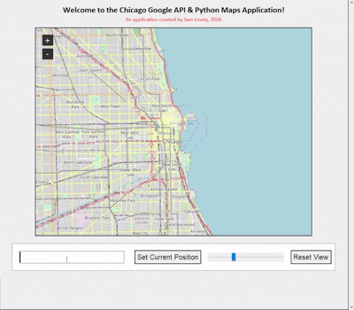
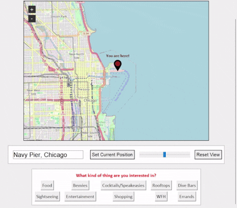
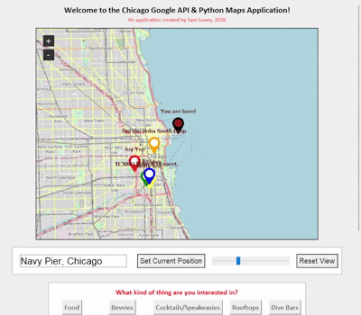
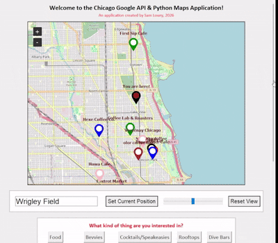
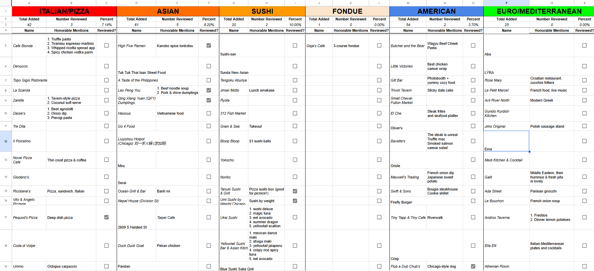
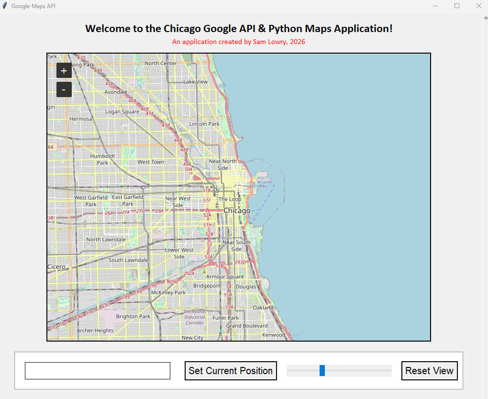
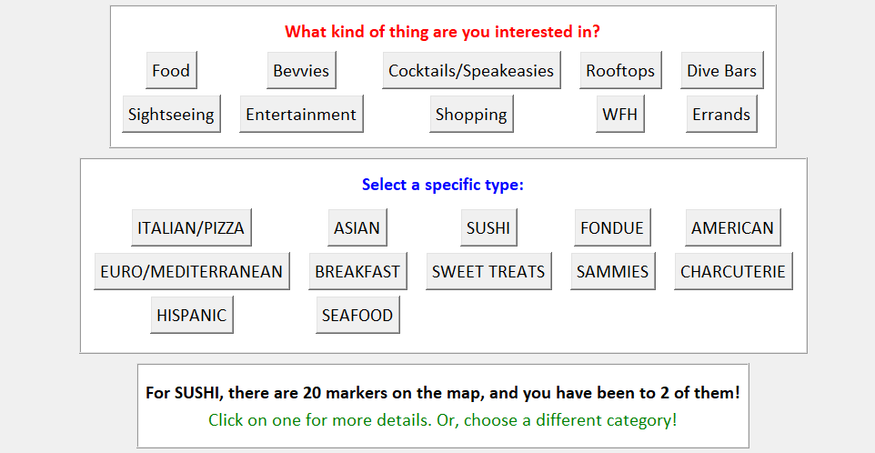
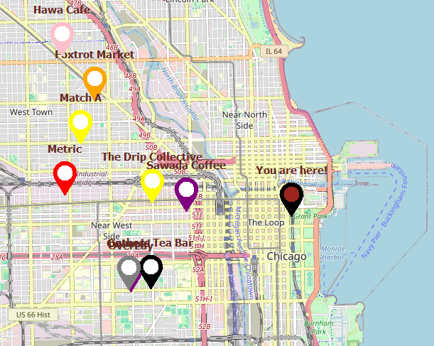
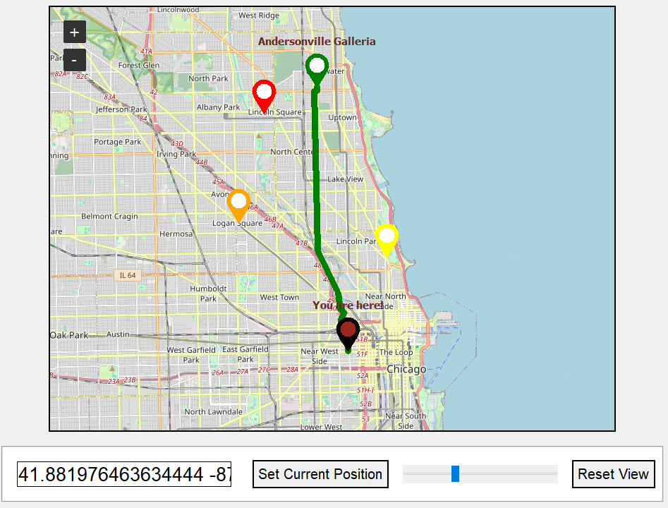
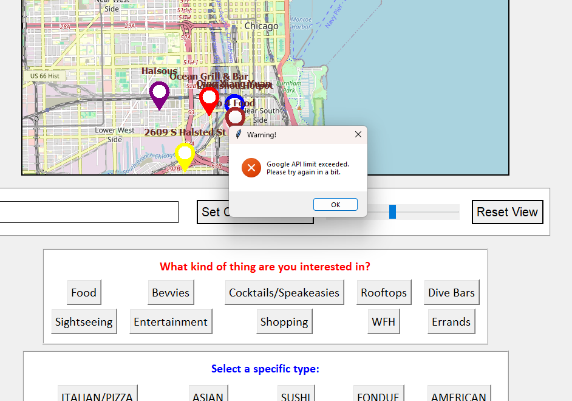

# Chicago Google Maps API Python App
When my partner and I moved to Chicago, we wrote down all of the restaurants, sights, and shops we
wanted to visit in an expansive Google Sheets document. 

Unfortunately, there is no direct way to convert between Google Sheets and Google Maps, which would allow us
to visually see each location at once, without tediously typing each into a maps application.

Thus, I decided to create my own Python GUI application using Tkinter and Google's REST APIs for my partner
and I to use, which searches for each location categorized by the sheets and titles in our Google spreadsheet.

This application accesses data from the spreadsheet, makes calls to Google's API tools, displays the data
utilizing Tkinter and Tkinter Map View - which functions as a visual map GUI.

In this project I utilized/learned the following:
- `Google Maps REST API`
- `Google Sheets REST API`
- `Python Tkinter GUI`
- `Tkinter Map View`
- `Python objects and dictionaries`
- `App UX`
- `Python and Tkinter Error Handling`
- `JSON`
- `File Manipulation`

<h2 align="center">
    
    
    
    
    
</h2>
<h2 align="center">
    
    
    
    
    
    
</h2>

*Built by Sam Lowry using Python, 2026*
